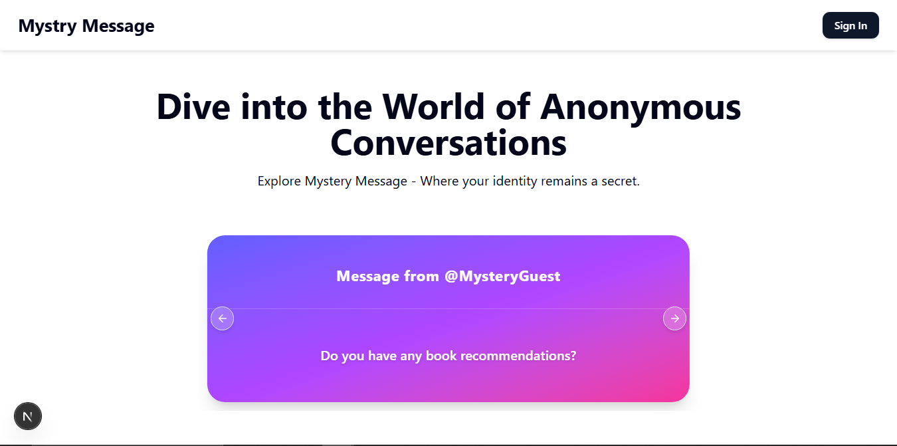
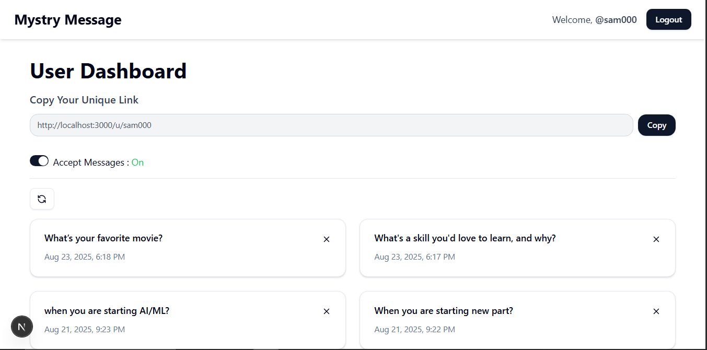
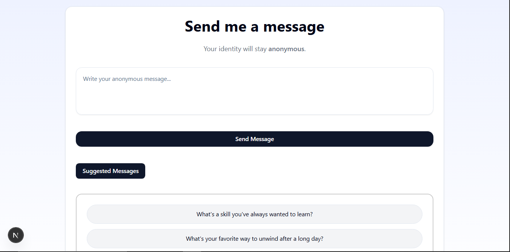

# Mystery Message

A web app to receive **anonymous messages** from your audience.  
Users can share their unique link, get feedback(messages) without revealing identity, and manage everything in a simple dashboard.

---







## ✨ Features

- User **signup with OTP email verification**
- Secure login system
- Dashboard to view received messages
- Unique shareable link for each user
- Anyone can send messages without login
- Toggle button to enable/disable message receiving
- AI-powered **Suggest Messages** (using Gemini)

---

## 🛠 Tech Stack

- **Frontend:** Next.js, Typescript, Shadcn UI, Tailwind CSS,
- **Backend:** Next.js API Routes
- **Database:** MongoDB
- **Auth:** NextAuth / JWT
- **Email Service:** Resend (for OTP verification)
- **AI:** Gemini API

---

## 🔗 How It Works

1. User signs up and logs in.
2. Gets a dashboard with:
   - Received messages
   - A unique shareable URL
   - Toggle to enable/disable messages
3. Share the link with your audience.
4. Anyone can send messages **without authentication**.
5. Optional: Get suggested message ideas via AI.

---

## 🚀 Setup

1. Clone the repo:
   ```bash
   git clone https://github.com/devoleper-samreen/messeges-project.git
   ```
